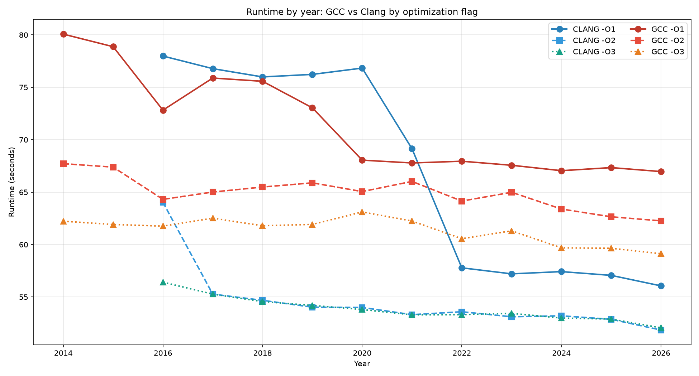
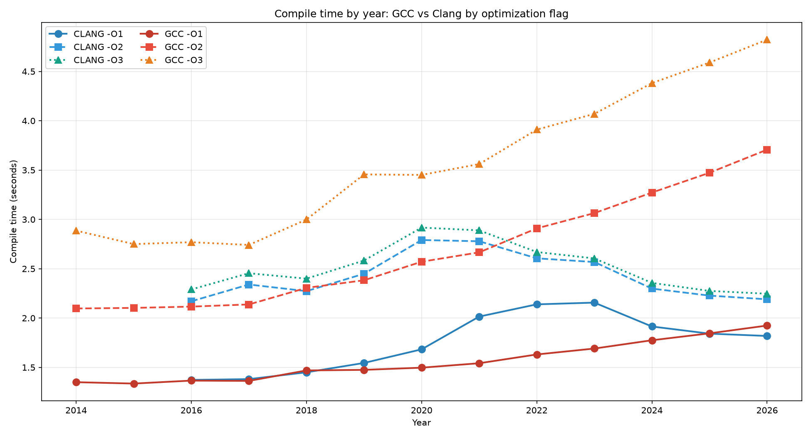

# C Stress Test

This is an amalgamated/simplified version of the LangArena benchmark
(https://github.com/kostya/LangArena) for the C language.

LangArena: A collection of 50 tasks across 26 languages - complex,
non-synthetic, and inspired by real-world problems (JSON, Base64, CSV,
neural networks, compression, maze A*, graph algorithms, sorting, hashing,
interpreters, parallel matmul, and more).

Fully "all in" - it has no external dependencies beyond the standard
libraries. That is, this file is completely self-contained and can be used
as a stress test for C compilers on its own, as well as for the optimizer.

It also includes the config directly in this file.

All parameters have been tuned so that each test runs for roughly 1 second
on my machine. That is, the total time is approximately 50 seconds (but
results may differ on other hardware).

### Build and run:

    gcc -Wno-format index.c -O3 -lm -o ./index
    ./index

# How GCC and Clang performance changed over 10 years: my experiment

I’ve always been fascinated by the history of compilers. So I compiled the same C index-c with GCC from 4 to 16 and Clang from 3 to 23 to see how compilers evolved.

For this I used an amalgamated version of the LangArena benchmark - which contains 50 different tests. I picked it because it tests complex real-world problems rather than synthetic loops or microbenchmarks. This benchmark produces real work that can’t be eliminated by DCE or reduced to a simple vectorized loop.

I compiled and ran it with all GCC and Clang versions available on Docker Hub:

GCC: 4.9.4, 5.5.0, 6.5.0, 7.5.0, 8.5.0, 9.5.0, 10.5.0, 11.5.0, 12.5.0, 13.5.0, 14.4.0, 15.3.0, 16.2.0.

Clang: 3.9.0, 4.0.0, 5.0.2, 6.0.1, 7.0.1, 8.0.0, 9.0.0, 10.0.1, 11.1.0, 12.0.1, 13.0.1, 14.0.6, 15.0.7, 16.0.6, 17.0.6, 18.1.8, 19.1.7, 20.1.8, 21.1.8, 22.1.8, 23.1.3.

Worth noting that all compilers were taken from public Docker builds (official gcc, kunitoki/clang, silkeh/clang) - and may have different glibc versions (this is not accounted for in the benchmark and may affect the results).

Results: below are two graphs grouped by compiler release year. Runtime is the index-c runtime compiled with the compiler versions released that year (major versions), averaged. For GCC it’s one compiler per year, for Clang it’s several per year. Compile time is the compile time for the same index-c, also averaged by compiler release year. -O0 was excluded because it’s mostly flat across all versions and clutters the graph.

Conclusion for GCC -O3 over 12 years:
* Runtime sped up by 5% (62.22s -> 59.13s). 
* Compile time slowed down by 66% (2.89s -> 4.82s).

Conclusion for Clang -O3 over 10 years:
* Runtime sped up by 8% (56.41s -> 52.15s).
* Compile time sped up by 4% (2.29s -> 2.19s).

For GCC, the results are a little surprising: compile time slowed down by 66% over 12 years. Maybe I made a mistake somewhere, so maybe it would look different on your hardware. Always check your own cases.

[reproduction script](https://github.com/kostya/index-c/blob/master/run.rb) and [raw data](https://github.com/kostya/index-c/blob/master/history.js)

All benchmarks were run 24 September 2026 on Ryzen 3800X, Ubuntu 24.04 (kernel 7.0.0-30-generic), Docker 28.3.2.

### Source includes:

* https://github.com/DaveGamble/cJSON
  MIT License (Copyright (c) 2009-2017 Dave Gamble and cJSON contributors)

* https://github.com/troydhanson/uthash
  Copyright (c) 2005-2026, Troy D. Hanson
  https://troydhanson.github.io/uthash/

* https://github.com/kokke/tiny-regex-c
  All material in this repository is in the public domain.

* https://github.com/wareya/Remimu/
  Creative Commons Legal Code

### MIT License
