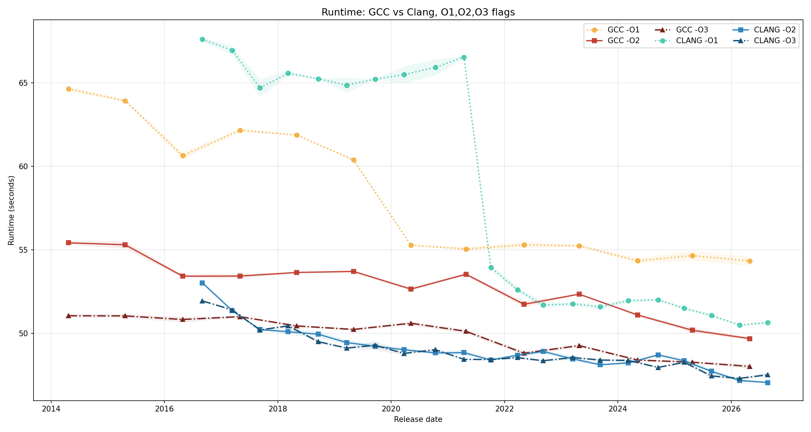
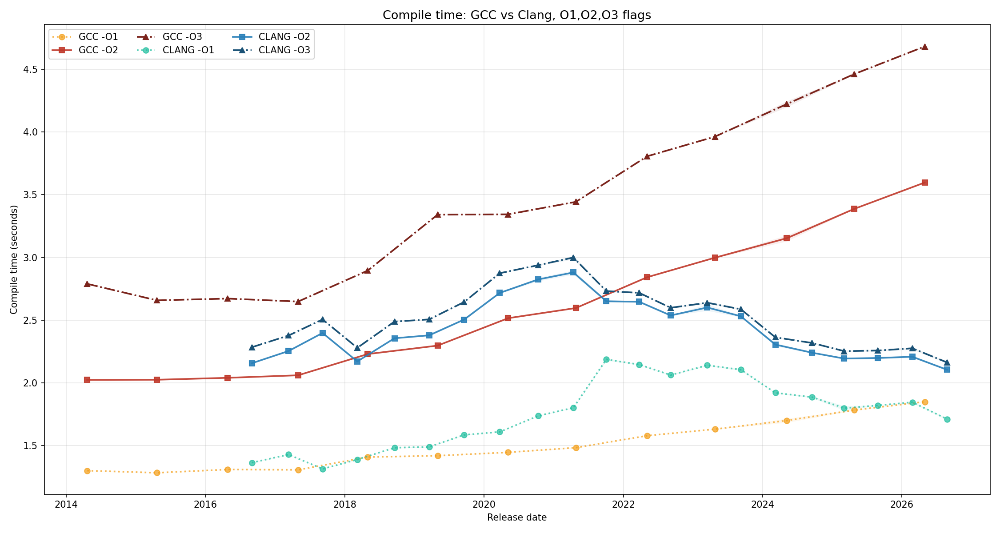
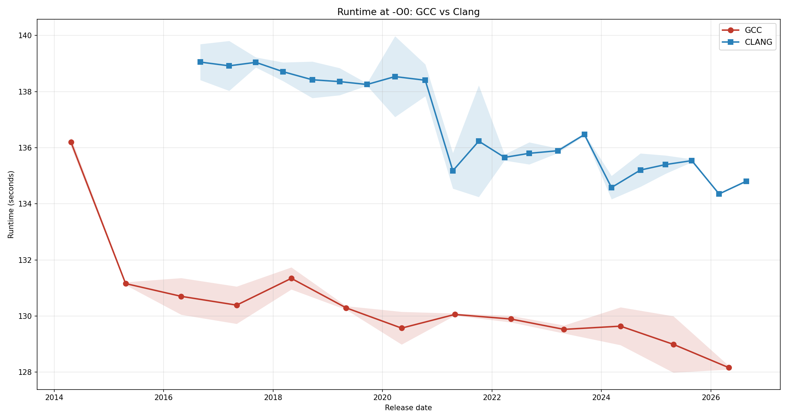
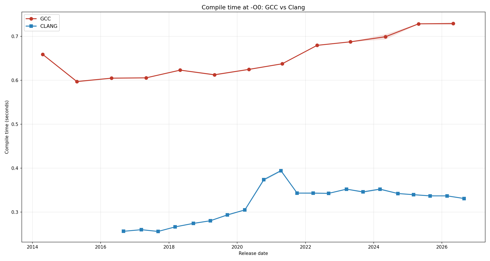
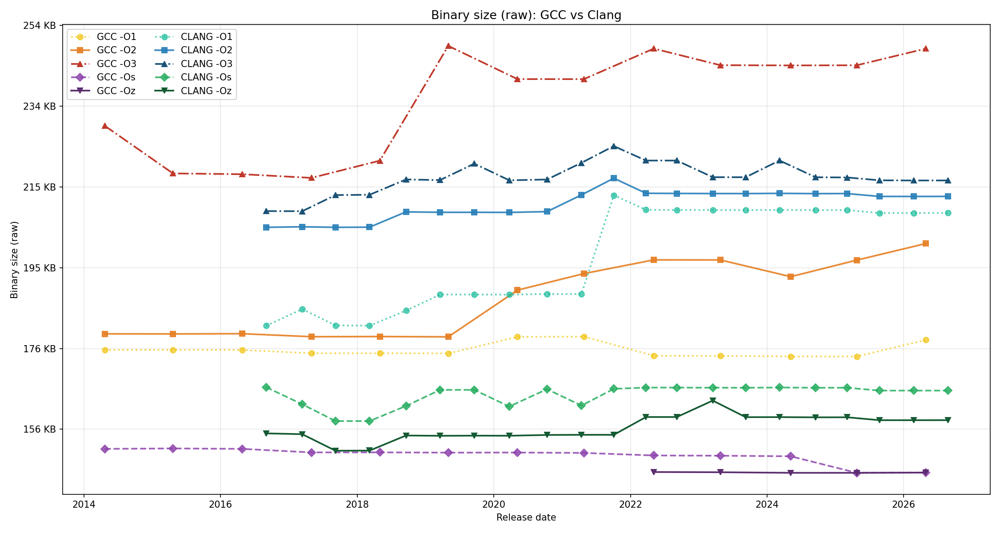
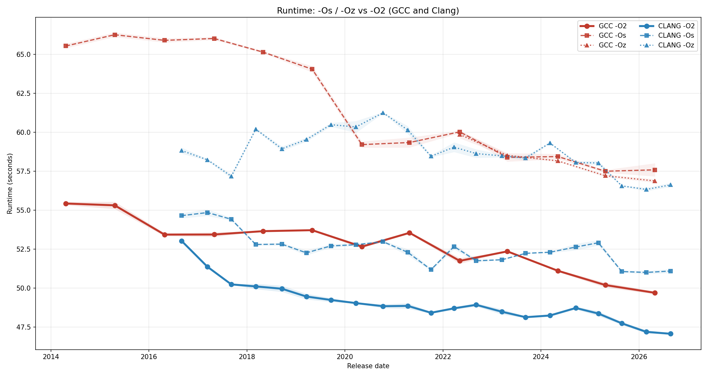
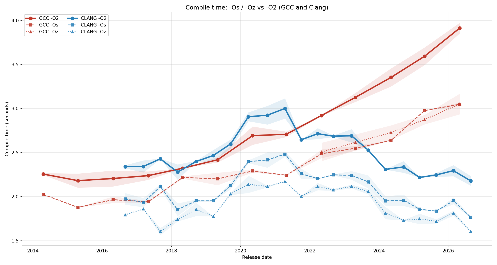
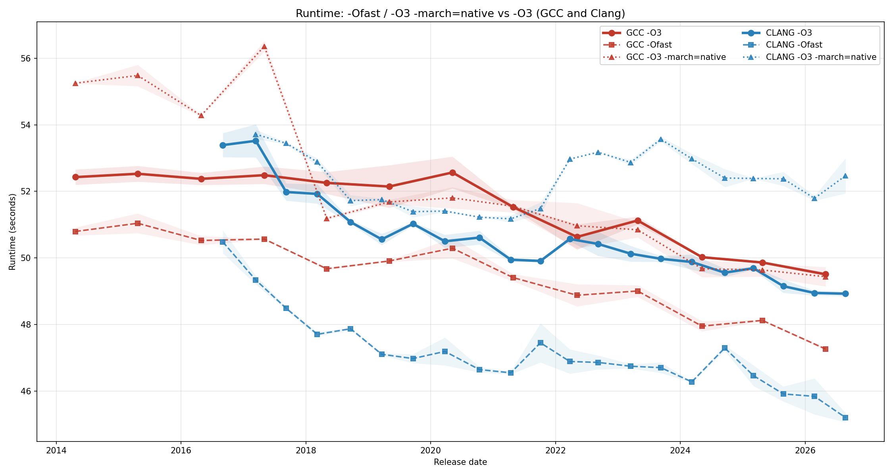
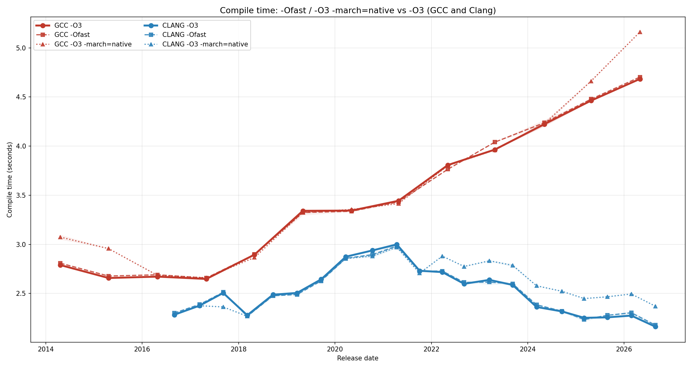

# C Stress Test

This is an amalgamated/simplified version of the LangArena benchmark
(https://github.com/kostya/LangArena) for the C language.

LangArena: A collection of 50 tasks across 26 languages - complex,
non-synthetic, and inspired by real-world problems (JSON, Base64, CSV,
neural networks, compression, maze A*, graph algorithms, sorting, hashing,
interpreters, parallel matmul, and more).

Fully "all in" - it has no external dependencies beyond the standard
libraries. That is, this file is completely self-contained and can be used
as a stress test for C compilers on its own, as well as for the optimizer.

It also includes the config directly in this file.

All parameters have been tuned on GCC 15 -O2, so that each test runs for roughly > ~1 second
on my machine. That is, the total time is approximately 53 seconds (but results may differ on other hardware).

### Build and run:

    gcc index.c -O3 -lm -lpthread -o ./index
    ./index

### Source includes:

* https://github.com/DaveGamble/cJSON
  MIT License (Copyright (c) 2009-2017 Dave Gamble and cJSON contributors)

* https://github.com/troydhanson/uthash
  Copyright (c) 2005-2026, Troy D. Hanson
  https://troydhanson.github.io/uthash/

* https://github.com/kokke/tiny-regex-c
  All material in this repository is in the public domain.

* https://github.com/wareya/Remimu/
  Creative Commons Legal Code

### MIT License

# Experiment: GCC and Clang performance over 10 years. Version 2.

I measured runtime, compilation time, and binary size for `index.c` across GCC 4.9–16.2 and Clang 3.9–23.1.3, using the flags `-O0`, `-O1`, `-O2`, `-O3`, `-Os`, `-Oz`, `-Ofast`, and `-O3 -march=native`.

Rerun on 2026-10-04. The first post was deleted because I was doing several measurements and the results were jumping around, so I started doubting them and deleted the post. Now I've done several runs and averaged the results (shown as spread bands on the graphs). I also tuned the configuration for `index.c` so it wouldn't be too favored toward Clang. In the previous run, Clang was much faster on the `Base64::Encode` test - its baseline was 1s on Clang but 8s on GCC, which hurt GCC a lot. Now this test is calibrated against GCC 1s, and the summary time no longer has a big gap against Clang because of a single test.

Keep in mind that these results are specific to my machine:

- **CPU:** Ryzen 3800X
- **RAM:** 64 GB DDR4-3200
- **OS:** Ubuntu 26.04
- **Docker:** 29.8.1

They will likely differ under other conditions, so I wouldn't recommend treating them as verified or official, or citing them in any source. This is just my experiment; whether to trust it is up to you. You can run the script below to reproduce it - it requires only Linux, Docker, and Ruby.

The benchmarks are run using Docker, with images pulled from Docker Hub. This can introduce uncertainty into the results, since each image may contain its own version of glibc and other unknowns. Compilation time can be affected by two additional factors: the compiler binaries may be statically or dynamically linked, and I/O in the Docker container.

**GCC:** 4.9.4, 5.5.0, 6.5.0, 7.5.0, 8.5.0, 9.5.0, 10.5.0, 11.5.0, 12.5.0, 13.5.0, 14.4.0, 15.3.0, 16.2.0.

**Clang:** 3.9.0, 4.0.0, 5.0.2, 6.0.1, 7.0.1, 8.0.0, 9.0.0, 10.0.1, 11.1.0, 12.0.1, 13.0.1, 14.0.6, 15.0.7, 16.0.6, 17.0.6, 18.1.8, 19.1.7, 20.1.8, 21.1.8, 22.1.8, 23.1.3.

### Results for `-O1`, `-O2`, `-O3`





Regarding the slowdown in GCC compile time, it is clearly reproducible with two simple commands (using the official GCC images):

```
docker run --rm -v `pwd`:/src -w /src gcc:7 bash -c 'time gcc /src/index.c -O3 -lm -lpthread -o /tmp/index'
```
real  0m2.879s

```
docker run --rm -v `pwd`:/src -w /src gcc:16 bash -c 'time gcc /src/index.c -O3 -lm -lpthread -o /tmp/index'
```
real  0m4.948s

This is also confirmed by this source: https://github.com/lac-dcc/BenchGen/wiki/Comparing-gcc-versions#1 `Comparing version 5 and version 14, there is an increase of about 42% over a span of 9 years.`

### Results for O0.





### Results for binary size.



### Results for Os, Oz vs O2.





### Results for "-Ofast", "-O3 -march=native" vs O3.





* [reproduce script](https://github.com/kostya/index-c/blob/master/experiment/run.rb)
* [raw data](https://github.com/kostya/index-c/blob/master/experiment/merged.js)

