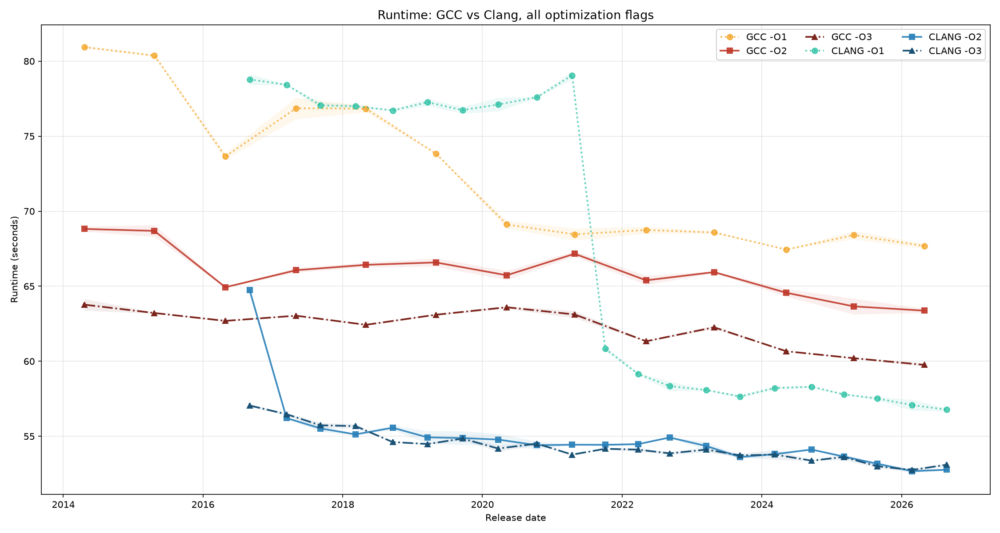
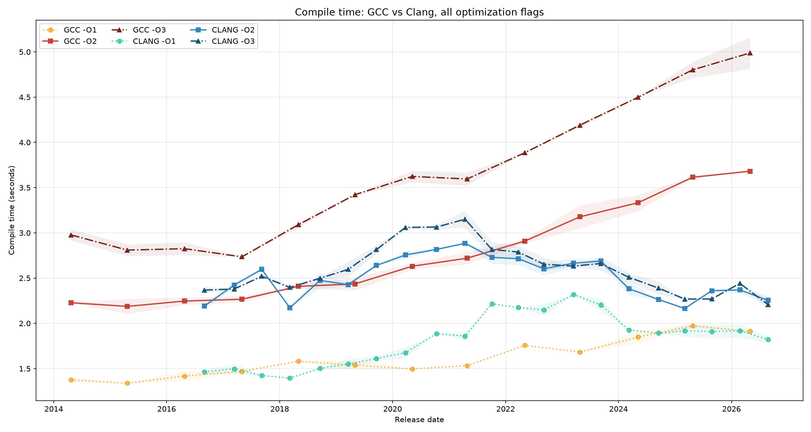
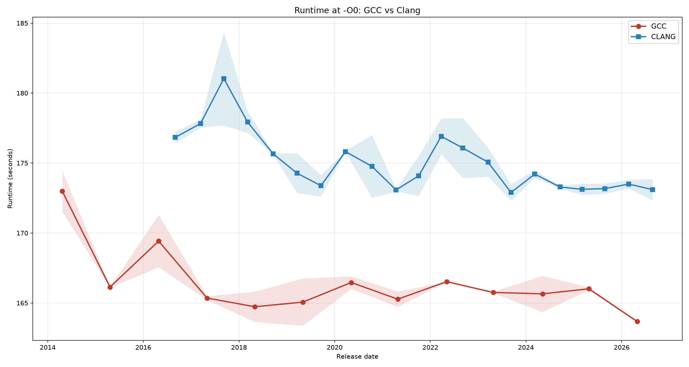
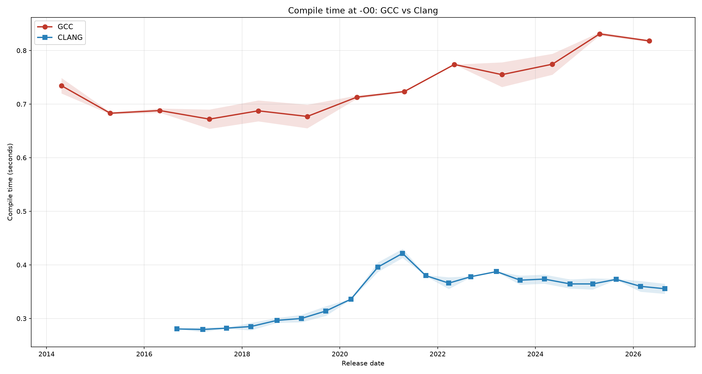
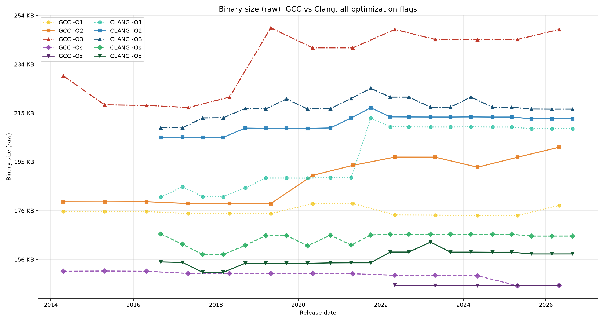
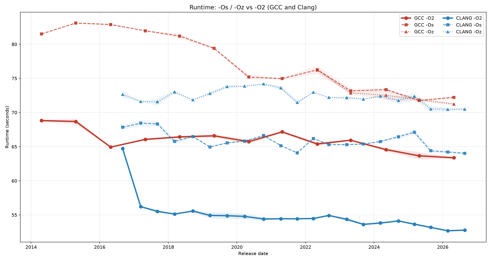
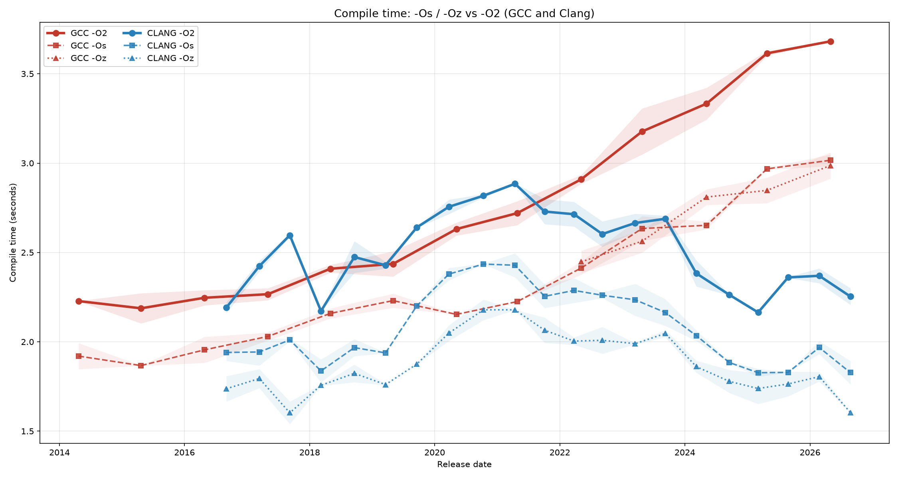

# C Stress Test

This is an amalgamated/simplified version of the LangArena benchmark
(https://github.com/kostya/LangArena) for the C language.

LangArena: A collection of 50 tasks across 26 languages - complex,
non-synthetic, and inspired by real-world problems (JSON, Base64, CSV,
neural networks, compression, maze A*, graph algorithms, sorting, hashing,
interpreters, parallel matmul, and more).

Fully "all in" - it has no external dependencies beyond the standard
libraries. That is, this file is completely self-contained and can be used
as a stress test for C compilers on its own, as well as for the optimizer.

It also includes the config directly in this file.

All parameters have been tuned so that each test runs for roughly > ~1 second
on clang and my machine. That is, the total time is approximately 53 seconds (but
results may differ on other hardware).

### Build and run:

    gcc -Wno-format index.c -O3 -lm -o ./index
    ./index

### Source includes:

* https://github.com/DaveGamble/cJSON
  MIT License (Copyright (c) 2009-2017 Dave Gamble and cJSON contributors)

* https://github.com/troydhanson/uthash
  Copyright (c) 2005-2026, Troy D. Hanson
  https://troydhanson.github.io/uthash/

* https://github.com/kokke/tiny-regex-c
  All material in this repository is in the public domain.

* https://github.com/wareya/Remimu/
  Creative Commons Legal Code

### MIT License

# Experiment: How GCC and Clang performance changed over 10 years.

I measured performance, compilation time, and binary size for index.c, across GCC 4–16 and Clang 3–23, with the flags O0, O1, O2, O3, Os, Oz.

Rerun on 2026-10-02. The first post was deleted because I was doing several measurements and the results were jumping around, so I started doubting the results and deleted it. Now I've done several runs and averaged the results (shown as spread bands on the graph). Keep in mind that these results are specific to my machine: Ryzen 3800X, DDR4-64GB (3200), Ubuntu 26.04, Docker 29.8.1. They can differ greatly under other conditions. So I wouldn't recommend treating them as verified or official, or citing them in any sources, etc. This is just my experiment; whether to trust them or not is your choice. You can run the script below to easily reproduce it - it requires only Linux, Docker, and Ruby.

The benchmarks are run using Docker, with the image pulled from Docker Hub. This can also introduce uncertainty into the results, since each image may contain its own version of glibc and other unknowns. Compilation time, in particular, is affected by two additional factors: the compiler binaries may be statically or dynamically linked, and the results often have a wider spread because they depend on I/O in Docker.

GCC: 4.9.4, 5.5.0, 6.5.0, 7.5.0, 8.5.0, 9.5.0, 10.5.0, 11.5.0, 12.5.0, 13.5.0, 14.4.0, 15.3.0, 16.2.0.

Clang: 3.9.0, 4.0.0, 5.0.2, 6.0.1, 7.0.1, 8.0.0, 9.0.0, 10.0.1, 11.1.0, 12.0.1, 13.0.1, 14.0.6, 15.0.7, 16.0.6, 17.0.6, 18.1.8, 19.1.7, 20.1.8, 21.1.8, 22.1.8, 23.1.3.

Results for O1, O2, O3.





Regarding the slowdown in GCC compile time, I'm not sure it isn't a glitch in my setup, but it's clearly reproducible with two simple commands (using the official GCC images):

```
docker run --rm -v `pwd`:/src -w /src gcc:7 bash -c 'time gcc -Wno-format /src/index.c -O3 -lm -lpthread -o /tmp/index'
```
real  0m2.879s

```
docker run --rm -v `pwd`:/src -w /src gcc:16 bash -c 'time gcc -Wno-format /src/index.c -O3 -lm -lpthread -o /tmp/index'
```
real  0m4.948s

I'm not drawing any conclusions from this, because these are results from my machine only - there could be other explanations. Even the official images could be built incorrectly or with different flags by mistake.

Results for O0.





Results for binary size.



Results for Os, Oz vs O2.





* [experiment run by simple ruby script](https://github.com/kostya/index-c/blob/master/experiment/run.rb) (requires Linux, docker and ruby) 
* [raw data](https://github.com/kostya/index-c/blob/master/experiment/merged.js)


